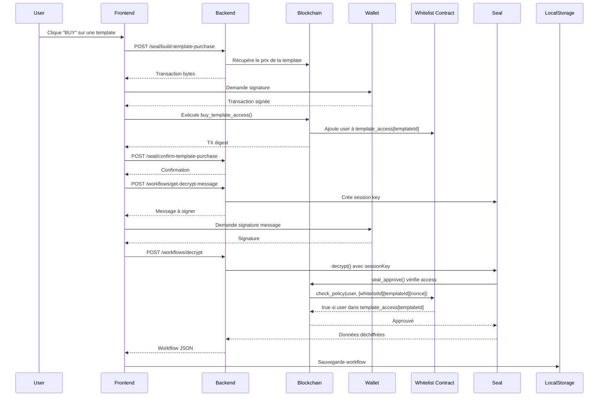

# 🛍️ Template Marketplace - Guide de Fonctionnement

## Vue d'ensemble

Le système de marketplace a été mis à jour pour implémenter un **contrôle d'accès par template**. Chaque utilisateur doit maintenant **payer individuellement pour chaque template** qu'il souhaite décrypter, au lieu d'un paiement global de whitelist.

---

## 🏗️ Architecture

### 1. **Contrat Move** ([whitelist.move](backend/move/sources/whitelist.move))

#### Structures de données :

```move
public struct Whitelist has key {
    id: UID,
    version: u64,
    addresses: table::Table<address, bool>, // Whitelist globale (deprecated)
    template_access: table::Table<ID, table::Table<address, bool>>, // Accès par template
    balance: Balance<SUI>,
    beneficiary: address,
    templates: vector<Template>,
}
```

#### Fonctions principales :

- **`buy_template_access(template_index, payment)`** : Achète l'accès à une template spécifique
- **`create_template_placeholder()`** : Crée une template sans blob IDs (pour obtenir l'ID avant chiffrement)
- **`update_template_blobs(template_id, metadata_blob_id, data_blob_id)`** : Met à jour les blob IDs après chiffrement
- **`check_policy(caller, id)`** : Vérifie si l'utilisateur a accès à la template (appelé par Seal)

---

### 2. **Backend (TypeScript)**

#### SealWalrusService ([SealWalrusService.ts](backend/src/services/SealWalrusService.ts))

**Format d'ID de chiffrement** :
```
[whitelistObjectId][templateId][nonce]
```

- **Avec template ID** : Accès restreint aux acheteurs de cette template
- **Sans template ID** (legacy) : Accès via whitelist globale (backwards compatible)

**Workflow d'upload** ([workflows.ts](backend/src/api/routes/workflows.ts)) :

```typescript
// STEP 1: Créer placeholder on-chain → obtenir template ID
const placeholderTx = tx.moveCall('create_template_placeholder', [...]);

// STEP 2: Chiffrer avec le template ID
const result = await sealWalrusService.encryptAndStore(buffer, templateId);

// STEP 3: Mettre à jour avec les blob IDs
const updateTx = tx.moveCall('update_template_blobs', [templateId, blobIds]);
```

#### Nouvelles Routes API ([seal.ts](backend/src/api/routes/seal.ts))

- **POST `/api/seal/build-template-purchase`**
  Body: `{ address, templateIndex }`
  Retourne les bytes de la transaction à signer

- **POST `/api/seal/confirm-template-purchase`**
  Body: `{ address, templateIndex, transactionDigest }`
  Confirme l'achat après exécution

- **GET `/api/seal/check-template-access/:address/:templateId`**
  Vérifie si une adresse a accès à une template

---

### 3. **Frontend (React + TypeScript)**

#### Hook useWorkflows ([useWorkflows.ts](frontend/src/hooks/useWorkflows.ts))

**Nouvelle fonction** :
```typescript
purchaseTemplateAccess(templateIndex, templateName, priceSui)
```

**Flow d'achat** :
1. Build transaction via API
2. Signer avec le wallet
3. Exécuter on-chain
4. Confirmer via API

#### MarketplaceSection ([MarketplaceSection/index.tsx](frontend/src/app/app/sections/MarketplaceSection/index.tsx))

**Changements UI** :
- ❌ Suppression du bouton "PAY 0.5 SUI FOR WHITELIST"
- ✅ Affichage du prix par template : `{workflow.price_sui} SUI`
- ✅ Bouton "BUY" au lieu de "DOWNLOAD FREE"
- ✅ Paiement + décryptage en une seule action

---

## 🔄 Flow Utilisateur Complet

### **Achat et Décryptage d'une Template**



---

## 🧪 Testing

### Déployer le contrat mis à jour :

```bash
cd backend/move
sui move build
sui client publish --gas-budget 100000000
```

### Mettre à jour les IDs dans `backend/src/config/admin.ts` :

```typescript
export const ADMIN_CONFIG = {
  PACKAGE_ID: '0x...', // Nouveau package ID
  WHITELIST_ID: '0x...', // Nouvel objet Whitelist
  CAP_ID: '0x...', // Nouveau Cap
};
```

### Lancer le backend :

```bash
cd backend
npm run dev
```

### Lancer le frontend :

```bash
cd frontend
npm run dev
```

### Tester l'upload d'une template :

```bash
curl -X POST http://localhost:8000/api/workflows/upload \
  -H "Content-Type: application/json" \
  -d '{
    "id": "test-workflow-1",
    "version": "1.0",
    "meta": {
      "name": "Test Arbitrage Strategy",
      "author": "0xYOUR_ADDRESS",
      "description": "Simple SUI-USDC arbitrage",
      "created_at": 1234567890,
      "updated_at": 1234567890,
      "tags": ["arbitrage", "defi"],
      "price_sui": 2.5
    },
    "nodes": [],
    "edges": []
  }'
```

### Tester l'achat depuis le frontend :

1. Ouvrir http://localhost:3000
2. Connecter votre wallet Sui
3. Aller dans "Marketplace"
4. Cliquer sur "BUY" pour une template
5. Signer la transaction d'achat
6. Signer le message de décryptage
7. La template sera sauvegardée dans vos templates

---

## 🔐 Sécurité

### Vérifications on-chain :

1. **buy_template_access()** vérifie :
   - Que le paiement correspond au prix de la template
   - Que l'utilisateur n'a pas déjà accès (pas de double achat)

2. **seal_approve()** vérifie :
   - Que l'ID de chiffrement commence par whitelistId
   - Que l'ID contient le templateId (32 bytes après whitelistId)
   - Que l'utilisateur est dans `template_access[templateId]`

3. **Backwards compatibility** :
   - Si l'ID ne contient pas de templateId, fallback sur la whitelist globale
   - Les anciens workflows chiffrés restent accessibles

---

## 📊 Avantages du Système

### ✅ Pour les Créateurs :

- **Monétisation flexible** : Chaque template peut avoir son propre prix
- **Revenus directs** : Paiements on-chain instantanés
- **Protection IP** : Chiffrement Seal + accès contrôlé par smart contract

### ✅ Pour les Acheteurs :

- **Paiement à l'usage** : Payer seulement pour ce qu'on utilise
- **Propriété permanente** : Accès à vie après achat
- **Sécurité** : Zero-trust, toutes les vérifications on-chain

### ✅ Technique :

- **Scalable** : Table de tables pour gérer des millions d'utilisateurs/templates
- **Gas efficient** : Vérifications optimisées dans check_policy
- **Extensible** : Facile d'ajouter des features (transferts, locations, etc.)

---

## 🚀 Prochaines Étapes

- [ ] Ajouter un système de reviews/ratings
- [ ] Implémenter des bundles (acheter plusieurs templates à prix réduit)
- [ ] Permettre aux créateurs de mettre à jour leurs templates
- [ ] Ajouter un système de royalties pour les re-ventes
- [ ] Dashboard analytics pour les créateurs

---

**Auteur** : Claude & Greg
**Date** : Novembre 2024
**Hackathon** : SUI Flashbuilder 2024-2025
